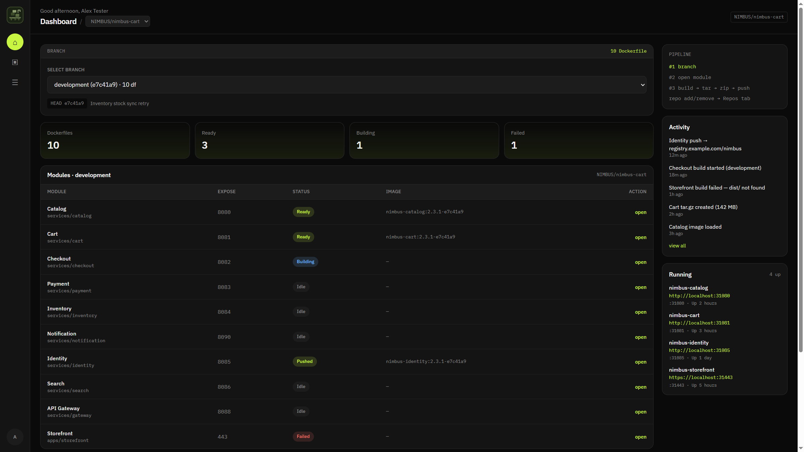
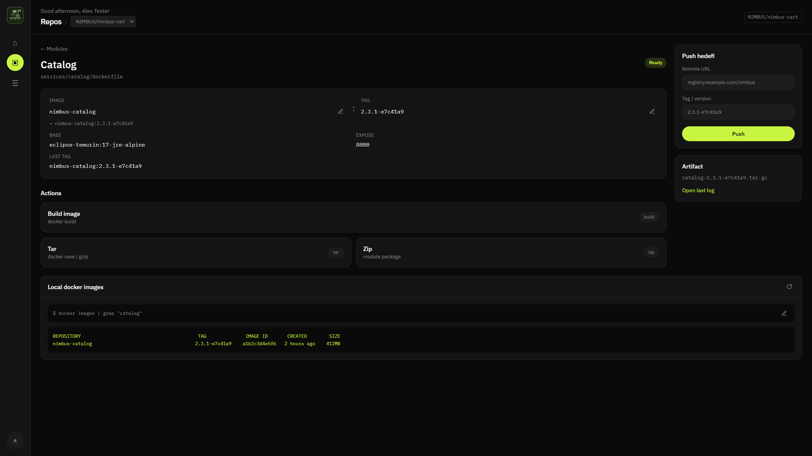

# Iskele

Build, package, and push Docker images from Git repositories. Pick a branch, open a Dockerfile module, and run the workflow from one place. Test Engineers already loves it.

## License

[MIT](LICENSE)
